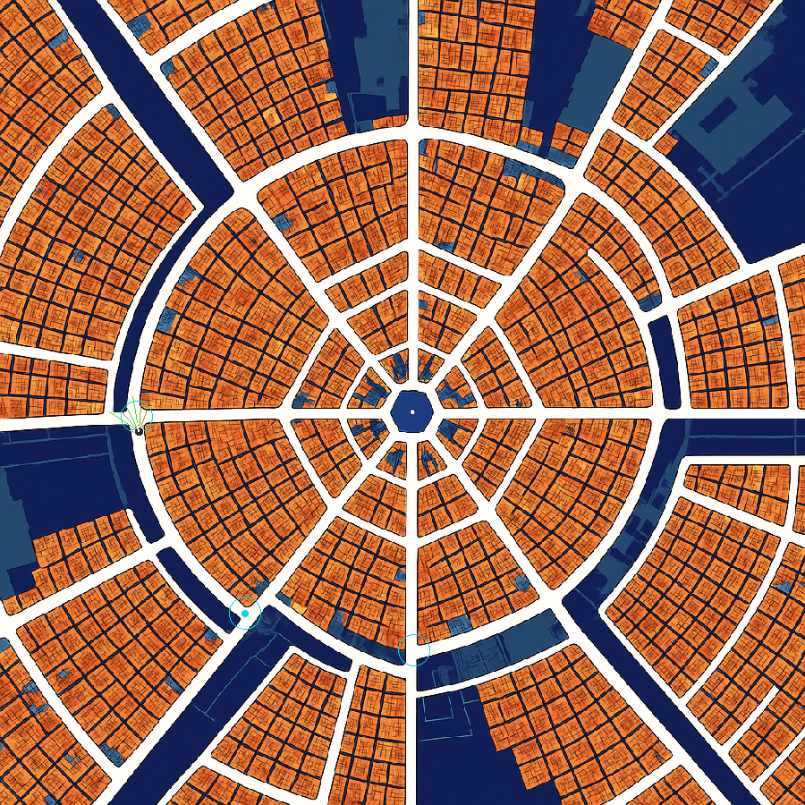
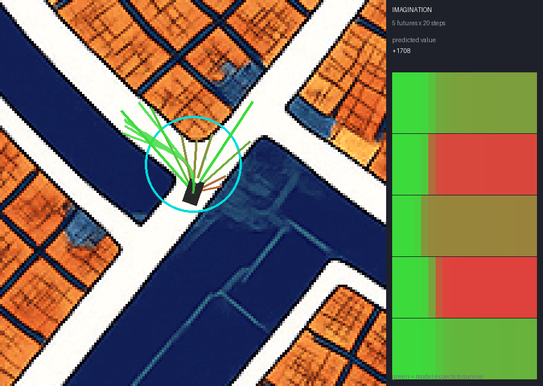

# Dreamerv3_car-nav

A standalone 2D car-navigation environment, extracted from the earlier T3D
(TD3) project so it can be driven by any learning algorithm. **This package
contains no learning code** — it is the environment only; `scripts/` holds
the separate DreamerV3 integration.

The car drives on the white roads of a city map image. It must reach a sequence
of goal points without leaving the road. Observations are an egocentric camera
crop plus a small goal/sensor vector; actions are continuous steering and speed.

**Current best DreamerV3 result** (vector-only `carnav_fast` task, continuous
sensors + dense crash-avoidance reward, evaluated on a fixed single target for
a fair comparison — see [Results](#results)): **70.0% crash rate, 30.0%
goal-reach**, with the earlier "only reaches targets directly ahead" failure
mode measurably fixed (far-target goal-reach 16.7–27.9% vs. a close-target
38.5%, no cliff). The same checkpoint can also drive a demo-time multi-target
chain (click 1–3 waypoints live) and show its own world-model imagination
running alongside the drive — see
[Watching the world model imagine](#watching-the-world-model-imagine).

## Why this exists separately

The original `citymap_t3d.py` entangled four things in one file: the simulator,
the TD3 agent, the replay buffer, and a PyQt6 GUI. That made the environment
impossible to reuse and impossible to test. Here they are split:

| | T3D version | this version |
|---|---|---|
| map lookups | one `QColor(img.pixel(x,y))` call per sensor per step | map decoded once into a NumPy RGB array + boolean road mask |
| dependencies | PyQt6 required to simulate at all | numpy + pillow; no Qt, no display |
| observation | 9 floats (angle, −angle, 7 binary sensors) | 64×64×3 egocentric crop + continuous-sensor vector (13-float default) |
| goal encoding | raw normalised angle, discontinuous at ±180° | `sin`/`cos` of bearing, continuous everywhere |
| actions | rotation in degrees, then a convoluted speed remap | both in `[-1, 1]` |
| episode end | single `done` flag | Gymnasium `terminated` / `truncated`, kept distinct |
| config | module-level constants | `CarNavConfig` dataclass, validated |

Keeping `terminated` and `truncated` separate matters for correctness, not
tidiness: a crash is a true terminal state whose value is 0, whereas hitting
the step limit is an arbitrary cutoff and the value function must still
bootstrap from the final state. Collapsing them teaches the agent that running
out of time is as good as parking safely.

## Install

```bash
conda activate t3d
pip install -r requirements.txt   # numpy + pillow only
```

## Use

```python
from car_env import CarNavEnv, CarNavConfig

env = CarNavEnv(CarNavConfig(num_targets=2))
obs, info = env.reset(seed=0)
obs, reward, terminated, truncated, info = env.step([0.0, 1.0])  # [steering, speed]
```

`obs` is a dict:

| key | shape | dtype | meaning |
|---|---|---|---|
| `image` | `(64, 64, 3)` | `uint8` | egocentric crop, car at centre facing row 0 |
| `vector` | `(4 + len(sensor_angles_deg) [+ 1],)` | `float32` | `[sin bearing, cos bearing, norm dist, norm speed] + sensors [+ road_distance]` |

Default config: 9 sensors at ±60/±45/±30/±15/0°, `road_distance` off →
`vector` is `(13,)`. The DreamerV3 `fast` task variant turns `road_distance`
on → `(14,)`.

Either observation can be switched off (`use_image=False` / `use_vector=False`).
The image alone is enough for a pixel-based world model, but the goal is often
outside the crop, so the bearing/range vector is included by default — no
world model can recover a target the camera never sees.

**Sensors are continuous, not binary.** `observations.sensor_distances`
ray-marches each angle in `sensor_step_px` increments out to
`sensor_max_range` (defaults: 1.5px steps, 45px range) and returns the
normalised distance to the first non-road pixel — 1.0 means clear all the way
out. This replaced an earlier single fixed-distance (10px) binary read: a
one-point sample can't tell "wall right there" from "wall not there yet," and
forced a short range to avoid a longer sample reading the road's own far edge
as "blocked" on this map's ~14px-wide corridors. A marched ray doesn't have
that failure mode, so it can safely look further ahead.

`info` carries `reward_parts`, a per-term breakdown of the reward — the
fastest way to tell whether a policy is being driven by progress, alignment,
the sensor/clearance bonus, or (see below) proximity avoidance. Terms:
`step`, `progress`, `alignment`, `clear_sensors`, `danger`, `caution`,
`crash`, `target`.

## Reward shaping: crash avoidance and multi-target chains

Two reward terms are built directly on the continuous sensor signal
(`car_env/config.py`/`env.py`):

- **`danger`** — a penalty that switches on once the *nearest* sensor
  reading drops inside `danger_margin_px` (default 8px) and scales up to
  `-reward_danger_scale` right at the wall. Before this, the only feedback
  about a near-miss was the terminal `-100` crash reward itself — this fires
  while there's still time for the policy to react.
- **`caution`** — a small bonus for slowing down specifically while inside
  `caution_threshold` of a wall, i.e. an explicit "brake near obstacles"
  incentive.

Both are capped well below `|reward_step|` (same reasoning as
`reward_per_clear_sensor`, below) so a policy can't profit from hugging a
wall instead of making progress — `min_speed` is also a hard floor, so it can
never fully stop to camp on the caution bonus either.

`num_targets` chains multiple goals per episode (`env.py`'s
`_sample_targets`); reaching a non-final target returns `terminated=False`,
so it's invisible to the continuation/discount head — chain length doesn't
change what that head has to learn, only how far apart real endings are in
time. `randomize_num_targets: True` samples the chain length uniformly from 1
to `num_targets` per episode instead of using a fixed count, so most episodes
stay at the easier single-target difficulty while the policy still directly
trains on the "reached one target, keep going" transition — added
specifically so a checkpoint's demo-time multi-target behaviour (see below)
isn't an untested generalisation hope.

## Scripts

```bash
python scripts/smoke_test.py     # contract assertions + determinism check
python scripts/preview_obs.py    # orientation assertions, writes previews/*.png
python scripts/benchmark.py      # steps/sec
```

`preview_obs.py` is worth running after any change to the renderer. A
transposed or mirrored crop axis is invisible in reward curves but fatal to
learning, so it checks the convention numerically: a landmark placed at a known
bearing must land in the expected third of the crop, for 6 bearings × 5
headings, and the in-image goal marker must fall within 2px of where the goal
geometrically is.

## DreamerV3 (needs the separate `dreamer` conda env; see `docs/dreamer-integration-plan.md`)

```bash
python scripts/test_embodied.py               # embodied.Env adapter conformance
scripts/train_carnav.sh --configs carnav ...   # resilient launcher, all args forwarded to main.py
python scripts/analyze_run.py <logdir>/run1    # crash rate / goal-reach rate / reward_parts trend
python scripts/eval_by_distance.py --checkpoint <logdir>/run1/ckpt --task fast --units 64
python scripts/watch_policy.py --checkpoint <logdir>/run1/ckpt --episodes 20
```

`eval_by_distance.py` stratifies goal-reach/crash rate by how far the target
was at episode start — the fastest way to tell whether a checkpoint has a
"only reaches targets it starts pointed at" problem versus a general policy-
quality one. Takes `--task`/`--units` for checkpoints trained on a non-default
variant/network width, and `--num-targets N` to force a fixed chain length at
eval time regardless of what the checkpoint trained on (needed for a fair
comparison against a checkpoint trained under `randomize_num_targets`, whose
raw aggregate numbers are otherwise an average over mixed task difficulty).

`watch_policy.py` loads a trained checkpoint and drives the real env with
it on CPU, saving a top-down contact sheet (car, road, goal, sensors) per
episode — directly comparable to what the old T3D PyQt6 GUI showed, unlike
the small 64×64 egocentric crop the agent actually sees. Note this codebase's
`Agent.policy()` samples from the learned distribution regardless of
`mode='train'`/`'eval'` — there's no separate greedy/deterministic eval mode
to opt into here.

`watch_policy_live.py` is the same idea, live, in a real window — reuses
the persistent display stack from `T3D-car-navigation/start_display.sh`
(Xvfb + x11vnc + noVNC), so viewing it remotely is the same SSH-tunnel
setup as the T3D GUI:

```bash
# on the box, once (or check it's still up): T3D-car-navigation/start_display.sh --daemon
DISPLAY=:1 python scripts/watch_policy_live.py --checkpoint <logdir>/run1/ckpt --task fast --units 64
# on your Mac: ssh -C -N -L 5900:localhost:5900 -L 6080:localhost:6080 ubuntu@<host>
# then vnc://localhost:5900 (Finder > Connect to Server) or http://localhost:6080/vnc.html
```

By default (fullmap view) it pauses before each episode for a **click-to-
target** setup — left-click the map to place one or more waypoints, then
right-click or Enter to drive, mirroring the old T3D GUI's "click a sequence"
workflow. `--auto` skips the pause and just drives continuously, using
whatever target sampling the task config already does (`carnav_fast`
randomises 1–3 targets on its own — no clicking needed to see multi-target
behaviour). `--imagine` adds the world-model imagination panel described
next.



*Continuous sensor rays (green→red by clearance, replacing the old fixed-
distance binary reading) and a 3-target chain (cyan markers, filled = active)
on the current best checkpoint.*

### Watching the world model imagine

The DreamerV3 clone (separate repo, `carnav-integration` branch) gained a new
inference-time entry point, `Agent.imagine(carry, length)`: roll the trained
world model forward from the car's current belief state with **no real
observations** — the same mechanism `imag_loss` trains against, exposed for
live use rather than only inside the training loss. `watch_policy_live.py
--imagine` uses it to show 5 independently-sampled imagined futures alongside
the real drive:



*Five ghost paths (ray-marched from the car's real pose, replaying the
model's own imagined actions through real kinematics) fanning toward a
target, and the side panel's per-sample survival curves — reading left to
right, green means "the model still expects to be driving," fading to red
where that particular imagined future is expected to end. This sample: three
futures stay mostly green, two turn red partway through — genuine
disagreement between five independent samples of the same trained model, not
five copies of one answer.*

Every pixel of colour in both the ghost paths and the panel comes straight
from the model's own decoded `continue_prob` (the `con` head) at each
imagined step — nothing is a heuristic label added after the fact. Confirmed
this is genuinely stochastic (not a deterministic unroll shown 5 times): two
calls from the identical starting state produce different imagined reward/
action sequences, since `RSSM.imagine` samples from a real categorical
distribution each step, not its mode.
`--imagine-samples`/`--imagine-length`/`--imagine-every` (defaults 5/20/3)
control how many futures, how far ahead, and how often it's recomputed (every
N real steps — `agent.imagine()` isn't free).

## Results

Fair same-task comparisons only — `carnav_fast` randomises `num_targets`
1–3, so its raw aggregate numbers aren't directly comparable to a fixed-
target run without forcing an equal task at eval time (`--num-targets`):

| checkpoint / eval task | crash rate | goal-reach |
|---|---|---|
| pre-sensor-upgrade (single-target only) | 77.5% | 22.5% |
| current, forced single-target | **70.0%** | **30.0%** |
| current, forced 3-target chain | 94.1% | 5.9% |

Distance-stratified (`eval_by_distance.py`, 150 episodes, forced single-
target): **38.5% / 16.7% / 27.9% / 23.9%** goal-reach across increasing
distance buckets — no cliff. The original complaint this integration set out
to fix ("only reaches the target when it's directly ahead, fails at multi-
turn approaches") is resolved; remaining failures are dominated by collision
avoidance, not navigation. Anecdotally (watching the live checkpoint drive),
most crashes look attributable to the car/road size margin itself — see
[Known constraint](#known-constraint-the-car-does-not-fit-the-roads) — rather
than a sensing gap; worth testing a slightly larger road-clearance setting
before assuming the reward/sensor mechanism is the remaining bottleneck.

## Throughput

Measured on this box (Tesla T4, 20k random steps, `scripts/benchmark.py`),
current default config (9 continuous sensors, footprint collision, swept
collision checking):

| config | steps/s |
|---|---|
| vector only | 3,029 |
| image only | 2,499 |
| image + vector, no rotation | 2,280 |
| footprint collision | 2,033 |
| image + vector (default) | 2,026 |
| image 96×96 + vector | 1,790 |

Lower than the pre-continuous-sensor numbers (ray-marching 9 angles is more
work than 7 fixed-endpoint samples), but DreamerV3 typically consumes a few
hundred to a few thousand env steps/s either way, so the environment is still
not the training bottleneck — see the box-constraints notes in
`docs/dreamer-integration-plan.md` for what actually is (mainly the
single policy-inference process, not env-stepping parallelism, and on this
particular 4-core box, whatever else is competing for CPU at the time).

## Known constraint: the car does not fit the roads

The map's roads have a median width of **14px**. T3D's original car was
**28×16px** — inherited from that project, and it dictates the collision
model. A car of length L and width W needs `hypot(L/2, W/2)` px of clearance
to occupy a point at any heading; eroding the road mask by that radius gives
how much of the map is legally drivable:

| car size | required clearance | road remaining | verdict |
|---|---|---|---|
| 28×16 (T3D original) | 17px | 0.0% | impossible |
| 20×12 | 12px | 0.1% | impossible |
| 14×8 | 9px | 0.7% | impossible |
| 10×6 (current default) | 6px | **12.8%** | tight |
| 8×5 | 5px | 22.5% | workable |

At the original 28×16 scale, `collision_mode="footprint"` (the whole car
must be on road) is unusable — every episode ends on step 1.

**Current default: `car_length=10, car_width=6, collision_mode="footprint"`.**
The car's whole rectangle must be on road — no more clipping buildings or
passing through gaps narrower than itself. This is a harder task than the
28×16/`center` combination the project started with (12.8% of road is
"tight," not "workable"), chosen deliberately on 2026-09-02 in exchange for
physical honesty; see `notes/journal.md` for the reasoning and
`car_env/embodied_env.py`'s `VARIANTS["legacy_center"]` to reproduce the
original, easier task for comparison.

Watching the current best checkpoint drive, most remaining crashes look like
the car clipping a wall by a pixel or two on a turn rather than driving
blind into one — consistent with "tight" being close to the limit of what
this collision margin allows even for a policy that's otherwise navigating
correctly. Worth testing `8×5` (22.5% drivable, "workable") before assuming
further reward/sensor tuning is the highest-leverage next lever; not done
this session.

## Layout

```
car_env/
  config.py        CarNavConfig dataclass, validated in __post_init__
  citymap.py       map image -> RGB array + road mask; erosion, spawn
                    sampling, road_distance_field (BFS shortest-path)
  observations.py  egocentric crop renderer, sensor_distances (ray-marched,
                    continuous), goal features
  env.py           CarNavEnv: reset/step, rewards (incl. danger/caution),
                    swept collision, goal chaining (fixed or randomised
                    num_targets)
  embodied_env.py  embodied.Env adapter (CarNav) + named task VARIANTS
  render.py        top-down debug rendering (humans only; agent never sees it)
scripts/
  smoke_test.py  preview_obs.py  benchmark.py  test_embodied.py
  train_carnav.sh  analyze_run.py  eval_by_distance.py
  watch_policy.py  watch_policy_live.py  _dreamer_common.py
assets/
  city_map.png  car.png
```

`car_env` never imports `render.py` at module level, so training processes stay
free of any drawing code.

The DreamerV3 clone itself (`agent.imagine`, the world-model imagination
entry point used by `watch_policy_live.py --imagine`) lives in a separate
repo — see `docs/dreamer-integration-plan.md` §11 for what changed there and
why.
